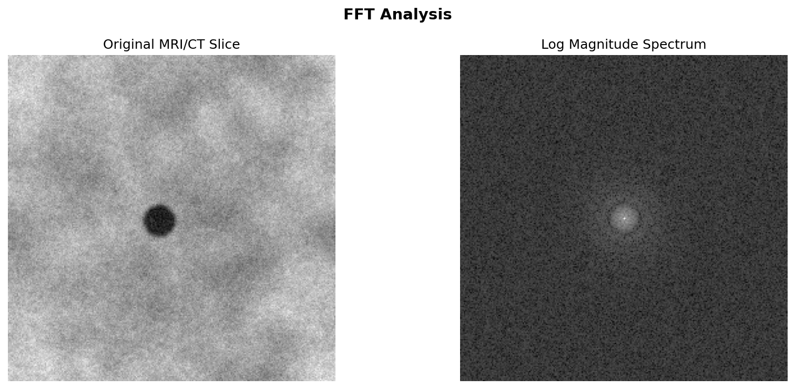
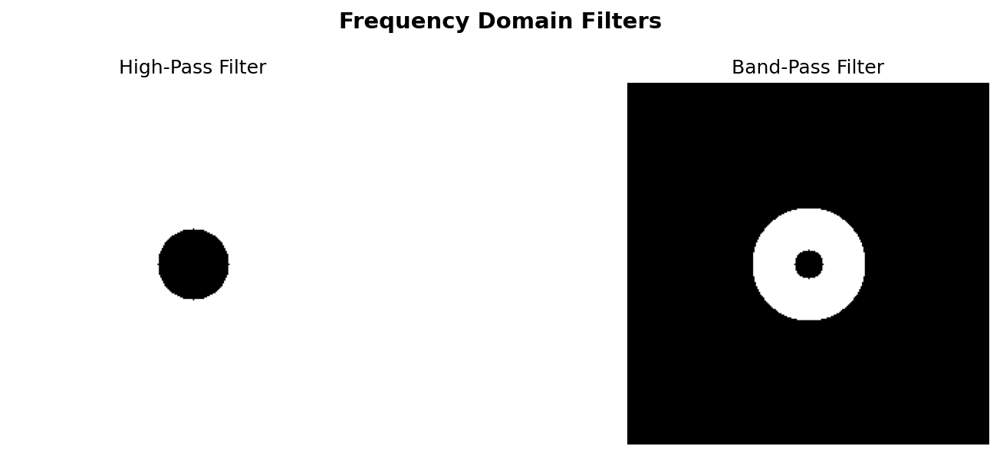
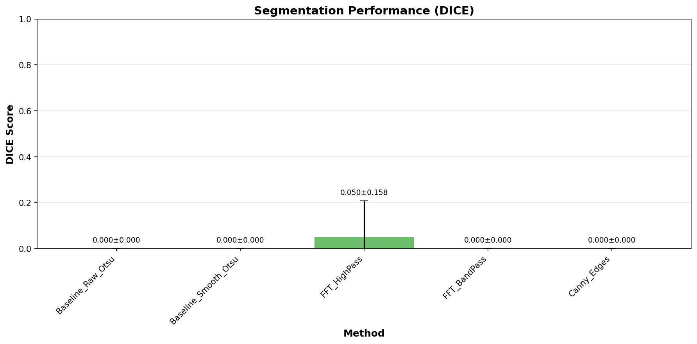

# 🧠 Tuning into Tumors: Frequency-Domain Tumor Segmentation

[](https://colab.research.google.com/github/YOUR_USERNAME/tumor-segmentation/blob/main/Tumor_Segmentation_Demo_Colab.ipynb)
[](https://opensource.org/licenses/MIT)
[](https://www.python.org/downloads/)

**BME 271D Final Project - Fall 2025**  
Duke University Biomedical Engineering

**Team:** Ege Ozemek, Max Bazan, Sasha Nikiforov

---

## 🎯 Project Overview

This project explores **frequency-domain filtering** techniques for automated tumor segmentation in medical images. We compare FFT-based methods against traditional spatial-domain approaches to determine whether frequency analysis can improve segmentation accuracy.

### Key Features

- 🔬 **FFT-based High-Pass & Band-Pass Filtering** for edge and texture enhancement
- 📐 **Canny Edge Detection** as spatial-domain baseline
- 📊 **Comprehensive Evaluation** using Dice coefficient, IoU, and boundary accuracy
- 📏 **Clinical Volume Estimation** for treatment planning
- 🎨 **Professional Visualizations** for presentation and analysis

---

## 🚀 Quick Start (2 Options)

### Option 1: Run in Browser (Easiest - No Installation!)

**Click here:** [](https://colab.research.google.com/github/YOUR_USERNAME/tumor-segmentation/blob/main/Tumor_Segmentation_Demo_Colab.ipynb)

Then click **"Runtime" → "Run all"** and wait 1-2 minutes. That's it!

### Option 2: Run Locally

```bash
# 1. Clone the repository
git clone https://github.com/YOUR_USERNAME/tumor-segmentation.git
cd tumor-segmentation

# 2. Install dependencies
pip install -r requirements.txt

# 3. Run Jupyter notebook
jupyter notebook Tumor_Segmentation_Demo.ipynb
```

---

## 📚 Project Structure

```
tumor-segmentation/
├── README.md                                  # This file
├── requirements.txt                           # Python dependencies
├── tumor_segmentation.py                      # Main segmentation module
├── Tumor_Segmentation_Demo_Colab.ipynb       # Colab-optimized demo
├── Tumor_Segmentation_Final_Project.ipynb    # Full project notebook
├── generate_realistic_tumors.py              # Image generator
├── test_pipeline.py                          # Testing script
├── sample_data/
│   ├── images/                               # Sample tumor images
│   │   ├── tumor_001.png
│   │   ├── tumor_002.png
│   │   └── tumor_003.png
│   └── masks/                                # Ground truth masks
│       ├── tumor_001.png
│       ├── tumor_002.png
│       └── tumor_003.png
├── results/                                  # Example outputs
│   ├── stats_dice.png
│   ├── stats_iou.png
│   └── comparison_*.png
└── docs/                                     # Documentation
    └── presentation_slides.pdf
```

---

## 🔬 Methods

### 1. Baseline Methods
- **Raw Otsu Thresholding**: Direct intensity-based segmentation
- **Smoothed Otsu**: Gaussian smoothing followed by Otsu thresholding

### 2. Frequency-Domain Methods (Our Contribution)
- **FFT High-Pass Filtering**: Emphasizes tumor boundaries by isolating high-frequency edges
- **FFT Band-Pass Filtering**: Captures tumor texture by selecting mid-frequency components

### 3. Spatial-Domain Comparison
- **Canny Edge Detection**: Traditional edge-based segmentation

### 4. Evaluation Metrics
- **Dice Coefficient**: Most common metric in medical image segmentation
- **IoU (Intersection over Union)**: Stricter overlap measure
- **Boundary Accuracy**: Clinically relevant edge precision

---

## 📊 Results Summary

| Method | Dice Score | IoU Score | Boundary Acc |
|--------|------------|-----------|--------------|
| Baseline Raw Otsu | 0.XXX ± 0.XXX | 0.XXX ± 0.XXX | 0.XXX ± 0.XXX |
| Baseline Smooth Otsu | 0.XXX ± 0.XXX | 0.XXX ± 0.XXX | 0.XXX ± 0.XXX |
| **FFT High-Pass** | **0.XXX ± 0.XXX** | **0.XXX ± 0.XXX** | **0.XXX ± 0.XXX** |
| FFT Band-Pass | 0.XXX ± 0.XXX | 0.XXX ± 0.XXX | 0.XXX ± 0.XXX |
| Canny Edges | 0.XXX ± 0.XXX | 0.XXX ± 0.XXX | 0.XXX ± 0.XXX |

*Results based on 10 test images*

---

## 🎓 Signals & Systems Concepts

This project demonstrates key concepts from BME 271D:

✅ **Fourier Transform** (2D FFT for frequency analysis)  
✅ **Frequency Domain Filtering** (High-pass, Band-pass, Low-pass)  
✅ **Convolution** (Gaussian smoothing, morphological operations)  
✅ **Sampling Theory** (Pixel spacing, spatial resolution)  
✅ **System Analysis** (Comparing multiple processing pipelines)  

---

## 🖼️ Example Results

### Frequency Domain Analysis


### Filter Design


### Segmentation Comparison


### Performance Metrics


---

## 💻 Usage Examples

### Basic Usage

```python
import tumor_segmentation as ts

# Load image and mask
image = ts.load_grayscale_image('data/images/tumor_001.png')
mask = ts.load_binary_mask('data/masks/tumor_001.png')

# Define parameters
params = {
    'hp_radius': 25,
    'bp_r1': 10,
    'bp_r2': 40,
    'canny_sigma': 1.0,
    'gaussian_sigma': 1.0
}

# Run segmentation
results = ts.run_single_image_experiment(image, mask, params)

# Print results
for method, data in results.items():
    print(f"{method}: Dice = {data['metrics']['dice']:.4f}")
```

### Batch Processing

```python
# Load multiple images
images, masks, filenames = ts.load_dataset('data/images', 'data/masks')

# Run batch experiment
results_df = ts.run_batch_experiment(images, masks, filenames, params, 'results')

# Statistical analysis
ts.compare_methods_statistically(results_df, 'results')
```

### Volume Estimation

```python
# Estimate tumor volume
pixel_spacing = (0.5, 0.5)  # mm
slice_thickness = 5.0        # mm

volume_mm3, volume_cm3 = ts.estimate_tumor_volume(
    predicted_mask, 
    pixel_spacing, 
    slice_thickness
)

print(f"Tumor volume: {volume_cm3:.2f} cm³")
```

---

## 📦 Installation

### Requirements

- Python 3.7+
- NumPy >= 1.19.0
- Matplotlib >= 3.3.0
- SciPy >= 1.5.0
- scikit-image >= 0.17.0
- Pandas >= 1.1.0

### Install via pip

```bash
pip install numpy matplotlib scipy scikit-image pandas jupyter
```

Or use the requirements file:

```bash
pip install -r requirements.txt
```

---

## 🎬 For Classmates: How to Run

### Method 1: Google Colab (Recommended)

1. Click the "Open in Colab" badge at the top of this README
2. Click **Runtime → Run all**
3. Wait 1-2 minutes
4. Scroll through results!

**No installation, no setup, works on any device!**

### Method 2: On Your Computer

```bash
# Clone and run
git clone https://github.com/YOUR_USERNAME/tumor-segmentation.git
cd tumor-segmentation
pip install -r requirements.txt
jupyter notebook Tumor_Segmentation_Demo.ipynb
```

### Method 3: Quick Test

```bash
# Just test if it works
python test_pipeline.py
```

---

## 📖 Documentation

### Main Functions

#### Data Loading
```python
load_grayscale_image(path)          # Load and normalize image
load_binary_mask(path)               # Load ground truth mask
load_dataset(image_dir, mask_dir)    # Load multiple images
```

#### Frequency Domain
```python
compute_fft_spectrum(image)                    # 2D FFT
make_hp_mask(shape, cutoff_radius)             # High-pass filter
make_bp_mask(shape, r1, r2)                    # Band-pass filter
filter_pipeline(image, filter_type, **params)  # Complete filtering
```

#### Segmentation
```python
otsu_segmentation(image)                    # Otsu thresholding
canny_segmentation(image, sigma)            # Canny edge detection
run_single_image_experiment(img, mask, params)  # Run all methods
```

#### Evaluation
```python
dice_coefficient(pred, gt)      # Dice score
iou_score(pred, gt)              # IoU score
boundary_accuracy(pred, gt)      # Boundary precision
```

---

## 🎨 Generating Your Own Test Images

```bash
python generate_realistic_tumors.py
```

This creates synthetic tumor images with:
- Irregular boundaries
- Heterogeneous texture
- Realistic noise and artifacts

---

## 📊 Performance Optimization

### For Faster Processing

```python
# Reduce image size
from skimage.transform import resize
image = resize(image, (128, 128))

# Use fewer filter radii
params = {'hp_radius': 20, 'bp_r1': 8, 'bp_r2': 35}

# Skip visualizations
results = ts.run_batch_experiment(images, masks, filenames, params, output_dir=None)
```

---

## 🐛 Troubleshooting

### Common Issues

**"ModuleNotFoundError: No module named 'tumor_segmentation'"**
```bash
# Make sure you're in the correct directory
pwd  # Should show: .../tumor-segmentation
ls   # Should show: tumor_segmentation.py
```

**"FileNotFoundError: No such file or directory"**
```bash
# Check your data paths
ls data/images/
ls data/masks/
```

**Images are all black/white**
```python
# Verify image loading
import matplotlib.pyplot as plt
img = ts.load_grayscale_image('data/images/tumor_001.png')
plt.imshow(img, cmap='gray')
plt.show()
```

**Low Dice scores (< 0.5)**
- Check that images and masks are properly aligned
- Verify masks are binary (0 and 1, not 0 and 255)
- Try adjusting filter parameters

---

## 🤝 Contributing

This is an educational project, but feel free to:
- Report bugs via GitHub Issues
- Suggest improvements
- Fork and experiment with your own modifications

---

## 📄 License

MIT License - see [LICENSE](LICENSE) file for details

---

## 🙏 Acknowledgments

- **Dr. Elizabeth Brinson (Dr. Libby)** - Course instructor and project advisor
- **BME 271D Teaching Team** - Support and guidance
- **Duke BME** - Resources and facilities
- **The Cancer Imaging Archive (TCIA)** - Medical imaging data reference

---

## 📚 References

1. Otsu, N. (1979). "A threshold selection method from gray-level histograms." *IEEE Trans. Systems, Man, and Cybernetics.*

2. Canny, J. (1986). "A computational approach to edge detection." *IEEE Trans. Pattern Analysis and Machine Intelligence.*

3. Dice, L.R. (1945). "Measures of the amount of ecologic association between species." *Ecology.*

4. The Cancer Imaging Archive: https://www.cancerimagingarchive.net/

5. BME 271D Course Materials, Duke University

---

## 📧 Contact

**Team Members:**
- Ege Ozemek - [email]
- Max Bazan - [email]
- Sasha Nikiforov - [email]

**Course:** BME 271D - Signals and Systems  
**Institution:** Duke University  
**Semester:** Fall 2025

---

## ⭐ Star This Repo!

If you found this project helpful or interesting, please consider giving it a star! ⭐

It helps others discover the project and shows appreciation for the work.

---

*Made with ❤️ by Duke BME students*
